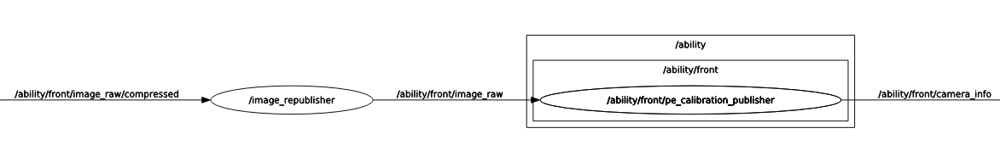

# ROS2 camera_info calibration publisher

This node parses a ROS CameraInfo YAML calibration file, subscribes to an image topic (`sensor_msg/msg/Image` or `sensor_msg/msg/CompressedImage`), 
and publishes the `camera_info` with the parameters contained in the YAML file

## How to compile

In a ROS2 sourced workspace

1. Install dependencies with rosdep:
`$ rosdep install --from-paths src --ignore-src -y`
2. Compile:
`$ colcon build`

## How to run
1. Source the workspace `source install/setup.bash`
2. Run:
```
$ ros2 run pe_calibration_publisher pe_calibration_publisher \
    --ros-args -p use_raw:=True -p "file:=/path/to/intrinsic_calibration.yaml" \
    -r __ns:=/camera/namespace
```

## Compressed topics
Change the `use_raw` param to `False`. The subscriber will subscribe instead to `image_raw/compressed` (`sensor_msg/msg/CompressedImage`).

```
$ ros2 run pe_calibration_publisher pe_calibration_publisher \
    --ros-args -p use_raw:=False -p "file:=/path/to/intrinsic_calibration.yaml" \
    -r __ns:=/camera/namespace
```

## Composition



## ROS CameraInfo calibration

```yaml
image_width: WIDTH
image_height: HEIGHT
camera_name: CAMERA_NAME
camera_matrix:
  rows: 3
  cols: 3
  data: [ Fx,     0,   CX,
          0.,     Fy,  CY,
          0.,     0.,   1.    ]
camera_model: plumb_bob
distortion_coefficients:
  rows: 1
  cols: 5
  data: [D0, D1, D2, D3, D4, D5]
rectification_matrix:
  rows: 3
  cols: 3
  data: [ 1.,  0.,  0.,
          0.,  1.,  0.,
          0.,  0.,  1.]
projection_matrix:
  rows: 3
  cols: 4
  data: [ FxO,    0.,    CxO,     0.     ,
          0.,     FyO,   CxO,     0.     ,
          0.,     0.,    1. ,     0.     ]

```